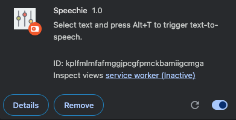
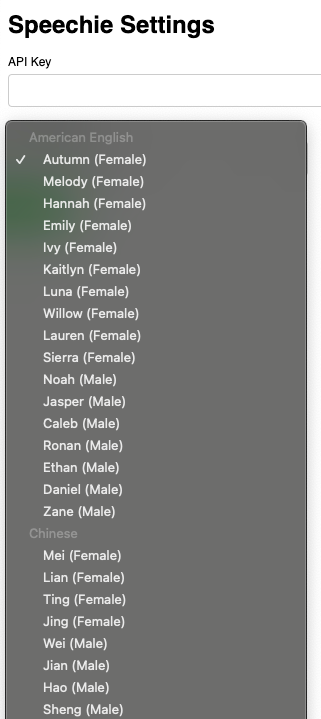

# Speechie Chrome Extension

## Description
Speechie is a Chrome extension that provides text-to-speech functionality directly in your browser. Select text and press Alt+T to trigger text-to-speech.

## Features
- Converts text to speech
- Customizable voice settings
- Works on any webpage
- Easy-to-use interface

## Installation
1. Clone the repository: `git clone https://github.com/activebook/speechie.git`
2. Open Chrome and navigate to `chrome://extensions/`
3. Enable "Developer mode" in the top-right corner
4. Click "Load unpacked" and select the cloned repository folder
5. Directly drag speechie.ctx file into the extensions setting.

## Usage
1. Click the Speechie extension icon to set api key.
2. Select text on a webpage and press Alt+T to trigger text-to-speech.
3. Use the player controls (Alt+A) to pause, resume, or stop playback

## Screenshots

## Contributing
1. Fork the repository
2. Create a new branch: `git checkout -b feature-name`
3. Make your changes and commit them: `git commit -m "Add new feature"`
4. Push to the branch: `git push origin feature-name`
5. Submit a pull request

## License
MIT License
